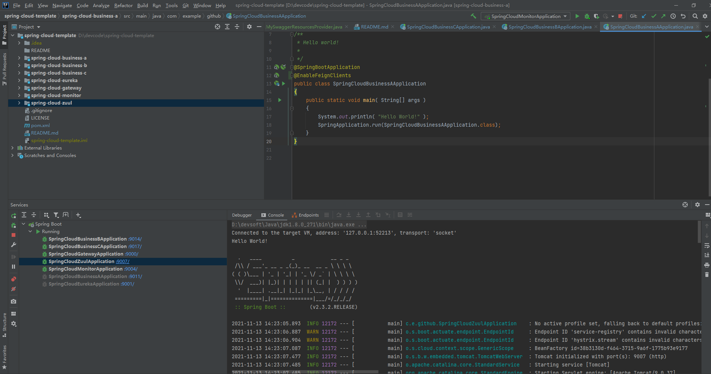
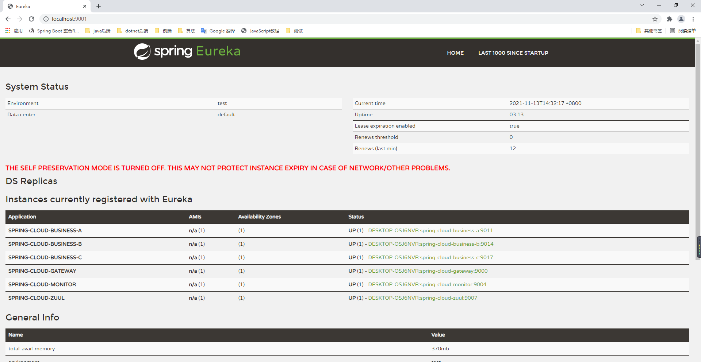
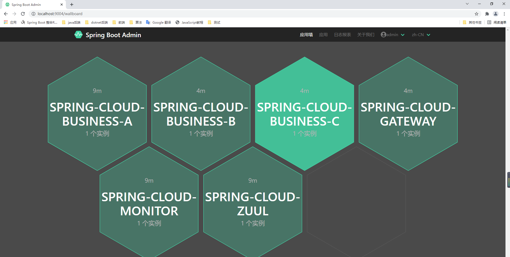
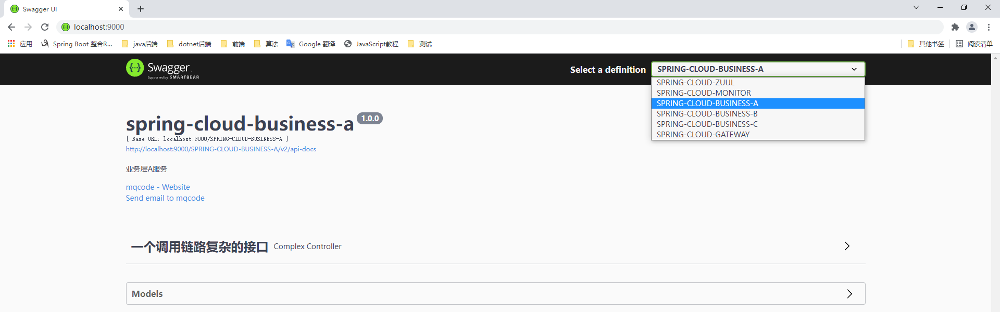
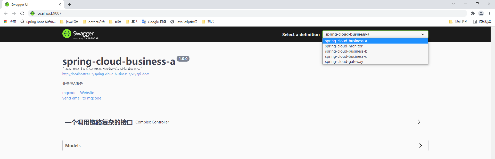

## spring-cloud-template  
> 一个高可用的微服务分布式样板工程,基于spring cloud & spring cloud alibaba

[](https://ci.spring.io/teams/spring-framework/pipelines/spring-framework-5.3.x?groups=Build")  
## 组件版本  
|  组件   | 版本  |
|  ----  | ----  |
| spring boot | 2.3.2.RELEASE |
| spring cloud  | Hoxton.SR9 |
| spring cloud alibaba  | 2.2.6.RELEASE |
## 更多版本对应关系请参考  
[Spring Cloud官网](https://github.com/spring-cloud/spring-cloud-release/wiki/Spring-Cloud-Hoxton-Release-Notes)  
[Spring Cloud Alibaba官网](https://github.com/alibaba/spring-cloud-alibaba/wiki/%E7%89%88%E6%9C%AC%E8%AF%B4%E6%98%8E)  

## 项目目录
以下模块均支持`分布式多节点部署`

|  模块   | 描述  |
|  ----  | ----  |
| spring-cloud-eureka | eureka注册中心 |
| spring-cloud-gateway | gateway网关 |
| spring-cloud-monitor | 基于spring-boot-admin的服务监控系统 |  
| spring-cloud-zuul | 基于zuul的网关 |  
| spring-cloud-business-a | 业务服务A |  
| spring-cloud-business-b | 业务服务B |  
| spring-cloud-business-c | 业务服务C |

## 各模块部署效果
### 整体工程

### eureka注册中心

### admin微服务监控

### Gateway网关聚合swagger3

### Zuul网关聚合swagger3


## 踩过的坑
```
两个SpringSecurity本地项目登录冲突问题
如：springbootadmin和eureka同时开启security权限
问题原因
跨域问题,同域名下cookie共享。
解决方案
hosts文件配置不同的域名,或者一个用127.0.0.1,另一个用localhost不要同域名访问。
```
## 使用经验
```
gateway加以下配置,和zuul任何配置都不加,效果一样
即从注册中心自动获取服务
spring.cloud.gateway.discovery.locator.enabled: true
```

## 关于作者
```
职业:软件工程师
微信:wlbinfo
开始制作时间:2021-11-12 19:00
```